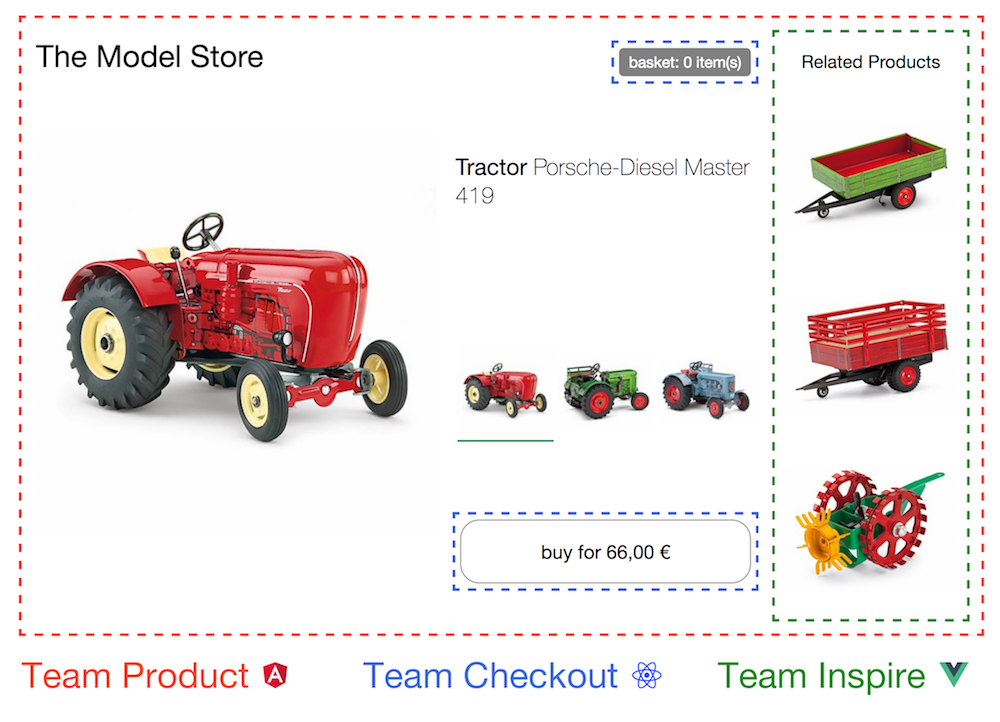
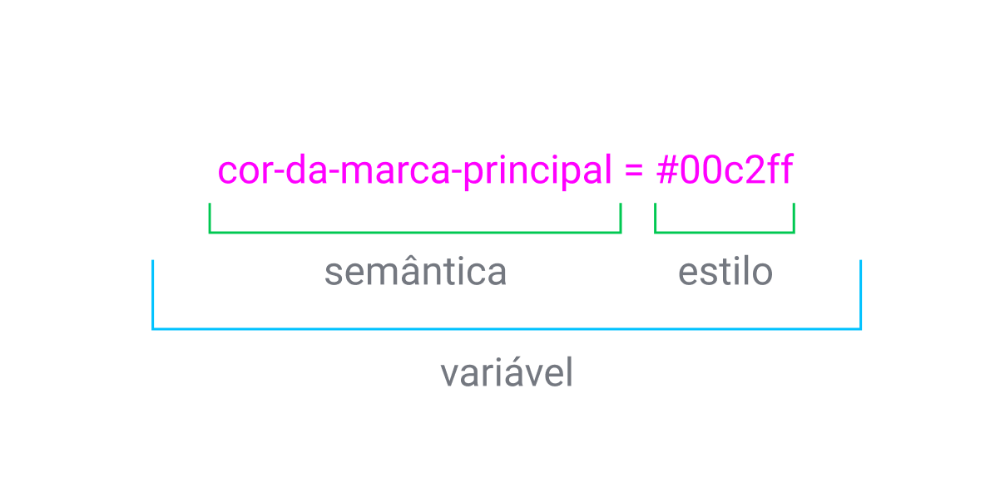

<!-- =============================== -->
<!-- HEADER -->
<!-- =============================== -->


&nbsp;

<a href="https://github.com/neo-florescence/NeoExpertise">
  <div align="center">
    
    
  </div>
</a>

&nbsp;


&nbsp;

<!-- =============================== -->
<!-- USEFUL LINKS -->
<!-- =============================== -->

<div align="center">
  <table>
    <tr>
      <a href="https://www.figma.com/file/OQxRg1s4Gf2XYVgt1WnzaA/NeoExpertise---Design-System%2C-Wireframe-And-Layout?node-id=4225%3A3174">
        
      </a>
    </tr>
    <tr>
      <a href="https://neo-florescence.notion.site/NeoExpertise-b820bc47823d44fb932b0dd4efe53ef4">
        
      </a>
    </tr>
  </table>
</div>

&nbsp;

<!-- =============================== -->
<!-- TABLE OF CONTENTS -->
<!-- =============================== -->
## Table Of Contents

- [Dados do projeto](#dados-do-projeto) 
  - [💾 Título do projeto](#titulo-do-projeto)
  - [🔭 Objetivo](#objetivo)
  - [📌 Justificativa](#justificativa)
  - [👤 Integrantes](#integrantes)
  - [📅 Calendário](#calendario)
- [Categorizações](#categorizações)
  - [❓ Tipo De Site](#tipo-de-site)
  - [🎯 Público Alvo](#publico-alvo)
  - [💢 Concorrentes](#concorrentes)
- [Ambiente De Desenvolvimento](#ambiente-de-desenvolvimento)
- [Git Workflow](#git-workflow)
- [Releases](#releases)
- [Arquitetura](#arquitetura)
- [Linguagens e Tecnologias](#linguagens-e-tecnologias)
- [Testes](#testes)
  - [Testes De Design](#testes-de-design)
- [Accessibilidade](#accessibilidade)
  - [🎨 Cor](#cor)
  - [📄 Formulários](#formulários)
  - [📷 Multimídia](#multimídia)
  - [📝 Estrutura De Um Documento](#estrutura-de-um-documento)
- [Figma](#figma)
  - [🍥 Design System](#design-system)
  - [♣️ Style Guide](#style-guide)
  - [🧰 UI Kit](#ui-kit)
    - [🌐 Figma - Glossário](#figma-glossário)
- [Formação Da Idéia](#formação-da-ideia)
  - [🆔 Registro Do Domínio](#registro-do-domínio)
  - [📱 Layout](#layout)
  - [👥 Equipe](#equipe)
    - [Design](#design)
    - [Front-End - Back-End](#frontend-backend)
    - [Documentação - Lições](#documentação-lições)
- [Atribuições](#atribuições)
- [Arquivamento](#arquivamento)
  - [🗃️ Repositório](#repositório)


&nbsp;

[INFORMÁTICA PARA INTERNET - Lista de Obrigatoriedades no TCC.pdf](https://s3-us-west-2.amazonaws.com/secure.notion-static.com/b75256ff-c56b-4f51-a3a5-858073983678/INFORMTICA_PARA_INTERNET_-_Lista_de_Obrigatoriedades_no_TCC.pdf)

[Manual De Desenvolvimento De TCC ETECJRM.docx](https://s3-us-west-2.amazonaws.com/secure.notion-static.com/cd9f2dd0-21b6-416c-9b1a-885f6e9e9527/Manual_De_Desenvolvimento_De_TCC_ETECJRM.docx)


<!-- =============================== -->
<!-- DADOS DO PROJETO -->
<!-- =============================== -->
<div>
  <h1 id="dados-do-projeto"><em><strong>Dados do Projeto</strong></em></h1>
  
  <h2 id="titulo-do-projeto">💾 Título do projeto</h2>
  NeoExpertise

  &nbsp;
  
  <h2 id="objetivo">🔭 Objetivo</h2>
  Entregar um site visualmente satisfatório e fácil de se navegar com o foco em entregar produtos de qualidade aos usuários.

  &nbsp;
  
  <h2 id="justificativa">📌 Justificativa</h2>
  Concluir a entrega do projeto anual e adquirir experiência no desenvolvimento de sites.

  &nbsp;
  
  <h2 id="integrantes">👤 Integrantes</h2>
  Thiago, Vinicius, Vitor Neves, Vitor Mendonça E Lucas.

  &nbsp;
  
  <h2 id="calendario">📅 Calendário</h2>
  08/02/2022 - 06/12/2022
</div>

&nbsp;

<!-- =============================== -->
<!-- CATEGORIZAÇÕES -->
<!-- =============================== -->
<div>
  <h1 id="categorizações"><em><strong>Categorizações</strong></em></h1>
  
  <h2 id="tipo-de-site">❓ Tipo De Site</h2>
  E-Commerce De Jogos

  &nbsp;
  
  <h2 id="publico-alvo">🎯 Público Alvo</h2>
  Jovens, Adultos e Gamers.

  &nbsp;

  <h2 id="concorrentes">💢 Concorrentes</h2>

  [KaBuM!](https://www.kabum.com.br), [Terabyteshop](https://www.terabyteshop.com.br), [Steam](https://store.steampowered.com), [Rocketz](https://rocketz.com.br), [Pichau](https://www.pichau.com.br), [Studio PC](https://www.studiopc.com.br/), [Redragon Store](https://www.redragon.store/)

  <details>
    <summary>Análise De Concorrência 2022</summary>
    <a href="https://docs.google.com/document/d/1fz_2yR7Vt0c4q0FeUMMbmm2sKXy45USYIjAZhVNuFtY/edit?usp=sharing">Análise da Concorrência (Google Docs)</a>
  </details>
</div>

&nbsp;

<!-- =============================== -->
<!-- Ambiente De Desenvolvimento -->
<!-- =============================== -->
<h1 id="ambiente-de-desenvolvimento"><em><strong>Ambiente De Desenvolvimento</strong></em></h1>

- Node Ver. 16 LTS


&nbsp;

***Yarn ou NPM/PNPM***

O Yarn e NPM ambos são gerenciadores de dependências para o Node.js.

Atualmente o *Yarn Berry* e a sua funcionalidade de “workspaces” ajuda no desenvolvimento da NeoExpertise, que hoje se
encontra em uma arquitetura Monolítica em um só repositório.

Também, uma funcionalidade muito utilizada é o
`enableGlobalCache` configuração que pode ser feita no `.yarnrc.yml`, e
guarda as dependências do projeto globalmente na máquina do desenvolvedor, o que, para nós, trouxe mais velocidade no
clone do repositório.

Dê uma olhada nas “ref's” para saber mais.

***Ref's:***
- [NPM VS Yarn](https://www.alura.com.br/artigos/npm-vs-yarn)

&nbsp;

***Yarn Workspaces***

O Yarn Workspaces nada mais é do que uma forma de distribuir e organizar diferentes projetos Node.js e instalar as dependências usando `yarn install`, isso permite o compartilhamento de dependências entre projetos, e a criação de projetos para serem usados internamente em outros projetos.


***Yarn Berry ou Yarn V2+***

O Yarn Berry refere-se a versão mais recente com maior suporte, melhores recursos e maior performance do Yarn. Nessa versão do programa você tem acesso aos *workspaces, plug’n’play, offline caches e plugins*.

O guia de migração e maiores detalhes sobre a escolha estão [aqui](https://yarnpkg.com/getting-started/migration).

&nbsp;

<!-- =============================== -->
<!-- Git Workflow -->
<!-- =============================== -->
<h1 id="git-workflow"><em><strong>Git Workflow</strong></em></h1>

O processo de criação de alguma feature, correção de bug e outros deve ser realizado da forma descrita abaixo. Tal método aumenta a segurança da aplicação e diminui consideravelmente a chance de features incompletas ou não testadas de entrarem na versão final do aplicativo/site.

→ Inicialmente, cria-se uma Issue relatando as mudanças planejadas.

→ É então criada uma nova *branch* utilizando...

```bash
git checkout -b <NomeDaBranch>
```

E após, trabalha-se na *branch* criada e realizam-se commits dentro dela.

Tais commits utilizarão o [*husky*](https://typicode.github.io/husky) e [*lint-staged*](https://github.com/okonet/lint-staged) que usufruem dos [*git hooks*](https://githooks.com).

O ***husky*** utiliza e suporta todos ***git hooks*** nativos e serve com intermediador para executá-los. Se tratando do ***lint-staged***, sua função é formatar todo código através dos ***linters*** disponíveis antes de um commit ser enviado ao repositório. Aqui há um [exemplo prático](https://www.youtube.com/watch?v=-qHA6zbOdLc) de ambos em ação.

Por final os ***git hooks*** são scripts que podem ser executados antes ou depois de eventos como ***commits, push’s e receive***. Você pode usar post-commits por exemplo, para notificar membros por email e fazer muito mais, tudo depende da sua imaginação.

→ É de obrigatoriedade fazer commits em pequenos push’s, cada uma ***feature*** ou ***bug fix*** deve ser realizado um commit único. Isso ajuda na organização do projeto no caso da necessidade de algum ***rollback***.

→ Depois, é realizado um PR (Pull Request) que será revisado por outros membros do projeto até entrar na *branch principal*.


&nbsp;

→ Se estiver interessado em contribuir, esteja usando o Yarn Berry...


&nbsp;

<details open>
  <summary><em>Comandos De Utilização Do Git</em></summary>

  *[Identificação Inicial](https://git-scm.com/book/en/v2/Getting-Started-First-Time-Git-Setup)*

  ```bash
  $ git config --global user.name "John Doe"
  $ git config --global user.email johndoe@example.com
  ```
  
  [*Branching E Merges*](https://git-scm.com/book/en/v2/Git-Branching-Basic-Branching-and-Merging)
  
  [Copiar Arquivos Ou Pastas De Uma Branch Para A Outra](https://stackoverflow.com/questions/307579/how-do-i-copy-a-version-of-a-single-file-from-one-git-branch-to-another)
  
  ```bash
  $ git checkout <NomeDaBranch> # Vá Para A Branch A Qual Quer Seu Arquivo Transferido
  $ git checkout <BranchComArquivo> <NomeDaPastaOuArquivo> # Copia Os Arquivos/Pastas Selecionadas Para A Branch Atual
  ```
  
  [Deletar Arquivos De Apenas Uma Branch](https://stackoverflow.com/questions/28331815/how-do-you-remove-files-from-one-and-only-one-branch-in-git)
  
  ```bash
  $ git checkout <NomeDaBranch> # Vá Para A Branch A Qual Quer Que Seu(s) Arquivo(s) Sejam(Será) Deletado. 
  $ git rm -r <NomeDasPastas/Arquivos>
  $ git push
  ```
</details>
    
&nbsp;

<!-- =============================== -->
<!-- Releases -->
<!-- =============================== -->

<h1 id="releases"><em>Releases</em></h1>

Nenhum plano está em ação quanto ao desenvolvimento das releases, sendo assim, qualquer grande bug fix ou feature será adicionada com uma nova release.

Caso ache que uma nova release é necessária, crie uma issue, então descreva a motivação da nova release e o número da próxima release, o nosso time irá ver a necessidade da mesma e caso aprovem, a release será lançada.

&nbsp;

<!-- =============================== -->
<!-- Arquitetura -->
<!-- =============================== -->

<h1 id="arquitetura"><em><strong>Arquitetura</strong></em></h1>

***Micro Front-Ends:***

Micro Front-ends consistem na criação de aplicações super independentes que no final constroem a aplicação como um todo.



*No exemplo acima, a tela de exibição do produto é feita em Angular, a de compra é feita em React e a lista de produtos relacionados é em Vue.*


Se cada pedaço da aplicação for independente, cada time pode escolher suas tecnologias, métodos de trabalho, horários de reunião, casos de teste, momento para deploy, etc. Assim, cada um conseguirá ter um melhor aproveitamento. Se uma equipe precisa atualizar a sua parte, a outra não precisa ser envolvida e nem terá seu trabalho influenciado.
Eles podem se comunicar, por exemplo, por um módulo de login e outro de compra de produtos, tendo ciência de qual usuário está logado para realizar a compra. Também poderás usufruir de *sessionStorage* (variáveis temporárias) e *localStorage* (variáveis gravadas mesmo com fechamento do navegador).


&nbsp;

<details open>
  <summary>Melhor Para</summary>

  → *Aplicações de grande porte;*

  → *Vários times e mais independentes;*

  → *Flexibilidade no geral;*

  → *Reunir tudo em um repositório/código fonte;*

  → *Utilizar microsserviços.*

  → *Integrar novos desenvolvedores no projeto.*

  → *Facilidade na coordenação entre times, correção de bugs e adicionar novas
  features.*

</details>

<details open>
  <summary>Não Trás Vantagem/Dores De Cabeça Em</summary>

  → *Pequenos projetos;*

  → *Poucas pessoas envolvidas;*

  → *Dependendo das situações a serem resolvidas;*

  → *Complexo;*

  → *Necessário alto nível de interdependências ao acoplar módulos;*

  → *Micro frontend está engatinhando; não há tantos materiais, e ainda não estão bem desenvolvidos*.

</details>

&nbsp;

<!-- =============================== -->
<!-- Linguagens e Tecnologias -->
<!-- =============================== -->

<h1 id="linguagens-e-tecnologias"><em><strong>Linguagens e Tecnologias</strong></em></h1>

***Front-end***
- [HTML](https://developer.mozilla.org/pt-BR/docs/Web/HTML), [CSS](https://developer.mozilla.org/pt-BR/docs/Web/CSS) & [JS](https://developer.mozilla.org/pt-BR/docs/Web/JavaScript).

> *Os três pilares do desenvolvimento web.*
- [SASS](https://sass-lang.com/), [TypeScript](https://www.typescriptlang.org/)

> *Um pré-processador e um superconjunto que melhora e adiciona diversos recursos para o desenvolvedor.*
- [React.js](https://pt-br.reactjs.org/), [Next.js](https://nextjs.org/)

> Frameworks para desenvolvimento de interfaces
- [Radix UI](https://www.radix-ui.com/) & [Stitches.dev](https://stitches.dev/)

> Biblioteca accesível de componentes para React e uma biblioteca CSS-in-JS com uma grande customização

&nbsp;

***Back-End***

- [PostgreSQL](https://www.postgresql.org/)

> Banco de dados
- [Prisma](https://www.prisma.io/), [PostgreSQL](https://www.postgresql.org/)

> ORM Javascript para utilização e consumo do banco de dados PostgreSQL
- [NodeJS](https://nodejs.org/en/), [Express](https://expressjs.com/pt-br/)

> *Ambiente de execução de JavaScript e seu framework para web.*

&nbsp;

***GitHub Actions***

- [Github Deploy Actions](https://github.com/JamesIves/github-pages-deploy-action)

> Ambiente de CI/CD usado para deploy e build da aplicação

&nbsp;

***Outros Pacotes***

- [Commitizen](https://github.com/commitizen/cz-cli)

> *Ferramenta para padronização de commits.*
- [Eslint](https://eslint.org/), [Prettier](https://prettier.io/), [StyleLint](https://stylelint.io/)

> *Ferramentas para a padronização de formatação de códigos.*
- [EditorConfig](https://editorconfig.org/)

> *Unifica as ferramentas de padronização de formatação de apenas um arquivo.*

&nbsp;

<!-- =============================== -->
<!-- Testes -->
<!-- =============================== -->

<h1 id="testes"><em><strong>Testes</strong></em></h1>

<h2 id="testes-de-design"><em><strong>Testes De Design</strong></em></h2>

- Espaço Em Branco Excessivo?
  > Espaços em branco são espaços sem elementos. Deve haver equilíbrio entre preenchimento com elementos e o espaço vazio em si.
    
- Algum Desalinhamento?
  > Observa-se algum desalinhamento que te causa desconforto entre elementos no site. Descreva.

- Contraste Ruim?
  > Deve haver legibilidade entre cores primárias e as cores de fundo. Aperte F12, clique no ícone do cursor e selecione o conteúdo que quer analisar, pegue a cor e coloque no site abaixo.
    
  [Color Contrast Checker - Coolors](https://coolors.co/contrast-checker/112a46-acc8e5)
    
- Cores Estranhas?
  > Se não existir harmonia entre as cores, evidencie.

&nbsp;

<!-- =============================== -->
<!-- Accessibilidade -->
<!-- =============================== -->

<h1 id="accessibilidade"><em><strong>Accessibilidade</strong></em></h1>

Aqui na NeoExpertise nós nos importamos MUITO, eu digo, MUITO com acessibilidade. Se estiver construindo algum elemento/componente para a UI, tenha certeza que é acessível para teclado, e os efeitos de flutuação (hover) estão funcionando.

Para te ajudar a construir elementos UI nós sugerimos [Radix](https://www.radix-ui.com/) e [HeadlessUI](https://headlessui.dev/), eles acompanham por padrão recursos de acessibilidade e seguem os parâmetros da [WAI-ARIA](https://www.w3.org/WAI/standards-guidelines/aria/). 

Se estiver interessado em alguns princípios básicos de acessibilidade, eles estão dispostos abaixo.

<h2 id="cor">🎨 <em><strong>Cor</strong></em></h2>

- Nunca dependa apenas de cores para transmitir informação.
- O contraste entre texto e cor de plano de fundo deve ser no mínimo 4.5 para 1. Utilize o [WebAIM](https://webaim.org/resources/contrastchecker/) para verificar seu contraste.

<h2 id="formulários">📄 <em><strong>Formulários</strong></em></h2>

- Projete em torno de elementos nativos do navegador sempre que possível.
- Projete focos visuais para campos e botões. Isso melhora a navegação por teclado.
- Rotule de forma clara todos os campos. Nunca esconda rótulos.

<h2 id="multimídia">📷 <em><strong>Multimídia</strong></em></h2>

- Sempre defina um texto alternativo (alt text) a uma imagem / conteúdo sem texto.
- Vídeos sempre devem incluir legendas.

<h2 id="estrutura-de-um-documento">📝 <em><strong>Estrutura De Um Documento</strong></em></h2>

- Siga padrões de designs já estabelecidos no site sempre que possível.
- Documentos devem possuir uma hierarquia clara estabelecida utilizando h1, h2, h3 etc. Isso ajuda nos leitores de tela.

&nbsp;

<!-- =============================== -->
<!-- Figma -->
<!-- =============================== -->

<h1 id="figma"><em><strong>Figma</strong></em></h1>

<h2 id="design-system"><em><strong>🍥 Design System</strong></em></h2>

É o conjunto completo de padrões do projeto, documentação e princípios, juntamente com o kit de ferramentas de design e código para atingir esses padrões e alcançar o objetivo da empresa. Ele é uma soma de um style-guide, sketch library, pattern library e todo o resto. Exemplo estrutural:


*“Um sistema de design não é um projeto, é um produto que serve produtos”. [Nathan Curtis](https://medium.com/eightshapes-llc/a-design-system-isn-t-a-project-it-s-a-product-serving-products-74dcfffef935)*

Em termos de recursos, o Design System foca em, tipicamente, “atomic design”, que contém 3 elementos chave:

- Átomos: Os elementos básicos, sejam formas, cores, ou princípios simples.
- Moléculas: Grupos de elementos combinados em recursos comuns, como caixa de texto, campos de formulário, seções do cabeçalho etc.
- Organismo: Templates feito de moléculas, como páginas da web e visualizações de aplicativos.

Por causa disto, mudar um átomo na livraria do Design System instantaneamente afetaria as moléculas correspondentes, que em seu turno elas modificam os organismos.

<h2 id="style-guide"><em><strong>♣️ Style Guide</strong></em></h2>

É uma subclasse no sistema de design. Uma documentação que descreve o próprio sistema de design: como os produtos devem parecer e se comportar, padrões de interface do usuário como tamanho de fonte, cores, botões e etc.

<h2 id="ui-kit"><em><strong>🧰 UI Kit</strong></em></h2>

O kit de interação de usuário (**U**ser **I**nterface) é uma coleção gráfica de arquivos (geralmente **P**hoto**S**hop **D**ocument)e recursos que podem ajudar designers com a tarefa de forjar a interface de usuários para algum projeto. Eles variam de complexidade, podendo ser botões, widgets, check boxes, barras de progresso, campos de formulários etc. De maneira geral, quanto mais você pagar, será mais extenso e variada a coleção de elementos dentro do kit. Há alguns kits que utilizam framework para sustentar o layout do site/app.

<details>
  <summary>Benefícios Gerais</summary>

  → *Salva notoriamente o seu tempo;*

  → *Melhor aproveitamento;*

  → *Não há limites a imaginação criativa;*

  → *Lhe permite focar em outras tarefas essenciais;*

  → *É mais fácil para modificar seu design;*

  → *Dá oportunidades de aprendizado.*
</details>


&nbsp;

Os Style-Guide’s “pertencem” ao Design System, então, estaremos comparando o Design System x UI kit. Quais são suas diferenças?
De contexto resumido, você irá querer o ?? se:

<details open>
  <summary>Design System</summary>

  1. É trabalhado em escalas maiores/duradouras e funciona para ambos designers e developers.
  2. Seus componentes centrais podem ser implementados através de apps, websites... Não é necessário replicar código.
  3. Por conta do design atômico e recursos revogáveis, devido mudanças constantes, o DS atualiza as mudanças rapidamente da base para cima em sua estrutura.
  4. É ótimo para prototipar de maneira rápida de salva bastante tempo do desenvolvimento de frontend.
  
</details>

<details open>
  <summary>UI Kit</summary>

  1. É usado em protótipos internos ou designs puramente visuais, poucas páginas, tudo bem rapidinho.
  2. O UI Kit não é focado em chamar ativos do UI com perfeição, então será necessário ajustes manuais, diferente do DS. 
  3. Atualizar requer que ele cheque todos os recursos, então nunca vai estar claro se a atualização foi completamente incrementada.
  4. Pode prototipar visto que é criado para puxar templates e o objetos para encaixar novas necessidades.
  
</details>

<details open>
  <summary>TL;DR 🥱</summary>

  Ambos focam em dar livrarias de design para serem utilizadas. Enquanto um dá templates visuais necessários para novas páginas, o Design System, por ser mais avançado, permite que a criação seja algo mútuo entre designers e desenvolvedores, além de remover possibilidades para erros, tendo um trabalho mais suave, consistente e de melhor qualidade.
  
</details>


&nbsp;

<h3 id="figma-glossário">🌐 Figma - Glossário</h3>

<details>
  <summary>Pattern Library?</summary>

  É uma subclasse no sistema de design, é o conjunto de padrões de design para uso em uma empresa.
  
</details>
    
<details>
  <summary>Sketch Library?</summary>

  Sketch Library são documentos com componentes, como símbolos, estilos de textos, variáveis de cor e estilos de camada que você pode compartilhar dentre seus outros documentos. É boa para trabalhar designs com elementos UI, ícones ou branding.
  
</details>

<details>
  <summary>Design Token?</summary>

  Design Token é, resumidamente, uma variavel semântica de estilo. Ela pode ser utilizada para mudar o estilo de vários mesmos componentes do site/app em pouco tempo, por exemplo, ao invés de trocar os componentes coloridos um de cada vez dentro de um site com 50 componentes individuais com essa mesma coloração, você irá poder trocar tudo de uma vez ao mudar poucos caracteres do código. Ele pode ser usufruído para hexadecimais, tamanho de fontes, tamanho de bordas, qualquer coisa que dá para estilizar.
    
  Ele está sendo citado aqui visto que é empregado e faz parte de um Design System.
  
  

</details>


&nbsp;

<!-- =============================== -->
<!-- Formação da Ideia -->
<!-- =============================== -->
<h1 id="formação-da-ideia"><em><strong>Formação da Ideia</strong></em></h1>

<h2 id="registro-do-domínio">🆔 Registro Do Domínio</h2>

[GitHubPages](https://neo-florescence.github.io/neo-expensive/old/index.html) (Old Neo Expensive)

<h2 id="layout">📱 Layout</h2>

[Figma](https://www.figma.com/file/OQxRg1s4Gf2XYVgt1WnzaA/Neo-Expertise---Wireframe%2FLayout-E-Outros?node-id=3%3A3)

<h2 id="equipe">👥 Equipe</h2>

<h3 id="design">Design</h3>

*Alessandro*

*Lucas*

[Equipe - Design.pdf](https://s3-us-west-2.amazonaws.com/secure.notion-static.com/086ce2d4-d15b-4928-aa35-8c12400b714d/Equipe_-_Design.pdf)

&nbsp;

<h3 id="frontend-backend"><em>Front-End</em> - <em>Back-End</em></h3>

Thiago Thalisson

Vitor Gouveia

&nbsp;

<h3 id="documentação-lições"><em>Documentação - Lições</em></h3>

Vitor Mendonça

Vinicius Aquino

&nbsp;

<!-- =============================== -->
<!-- Atribuições -->
<!-- =============================== -->
<h1 id="atribuições"><em><strong>Atribuições</strong></em></h1>

[Sprints](https://www.notion.so/50a985e8fb874a978e11930e3cf60831)

&nbsp;

<!-- =============================== -->
<!-- Arquivamento -->
<!-- =============================== -->
<h1 id="arquivamento"><em><strong>Arquivamento</strong></em></h1>

<h2 id="repositório">🗃️ Repositório</h2>

[https://github.com/Neo-Florescence/neo-expensive](https://github.com/Neo-Florescence/neo-expensive)
